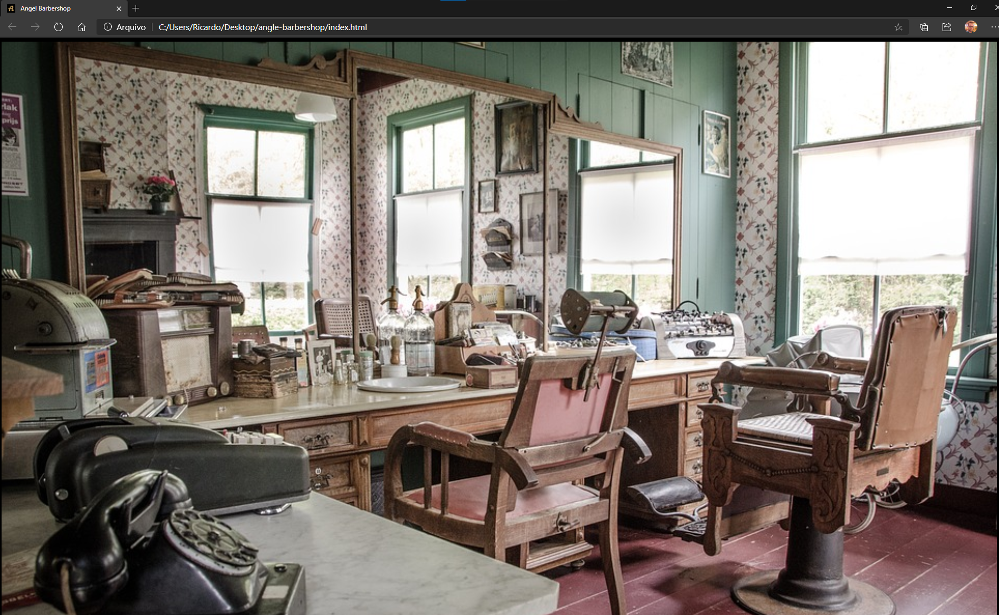
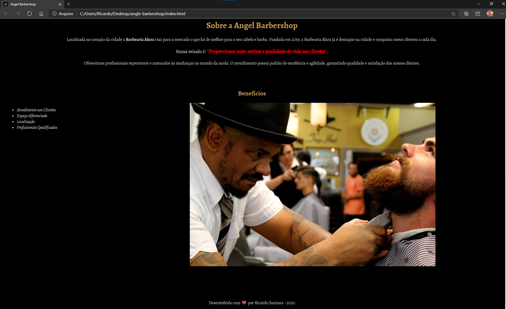

# Angel Barbershop

  
## :superhero: Angel Barbershop

Este repositório contém um pequeno projeto que consiste em uma página web.  Foi proposto no curso ****HTML5 e CSS3 parte 1: A primeira página da Web**** ministrado por [Pedro Marins](https://www.linkedin.com/in/pedromarins/) na plataforma de cursos [Alura](https://www.alura.com.br/).

  

## :clipboard: Sobre o projeto

O projeto feito durante o treinamento de HTML5 e CSS3. Trata-se de uma página básica com intuito apenas de apresentar as linguagens.

Fiz algumas modificações :writing_hand:
* Alterei as imagens
* Adicionei um favicon
* Cores de fundo e das fontes
* Alterei a fonte
* Acrescentei um rodapé
 
:grey_exclamation: Não utilizei os padrões e boas práticas, se trata apenas de um exercício. 

## :desktop_computer: Pré-requisitos

* Um navegador web

## :arrow_forward: Como executar o projeto

Basta clicar no arquivo index.html

## :pencil2: Licença

Este projeto sob licença MIT.

Feito com ❤️ por Ricardo Santana

